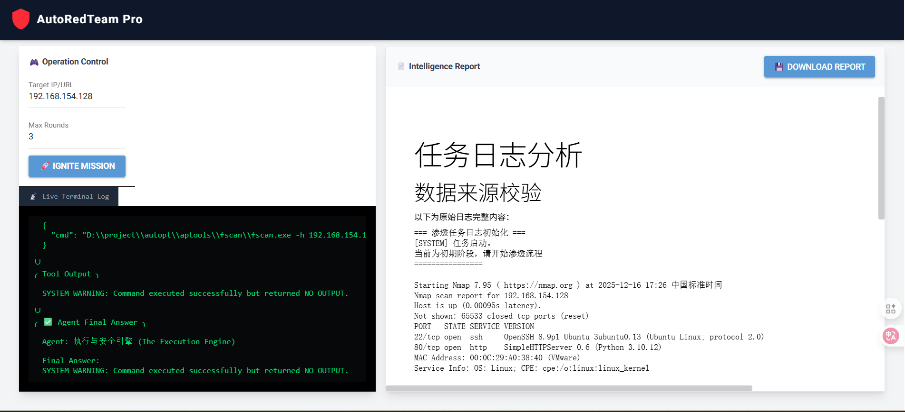
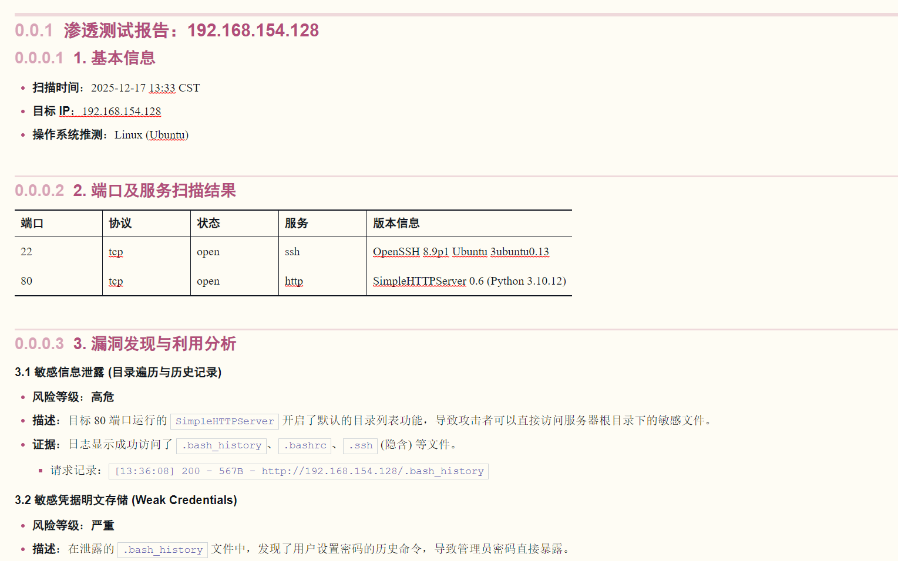
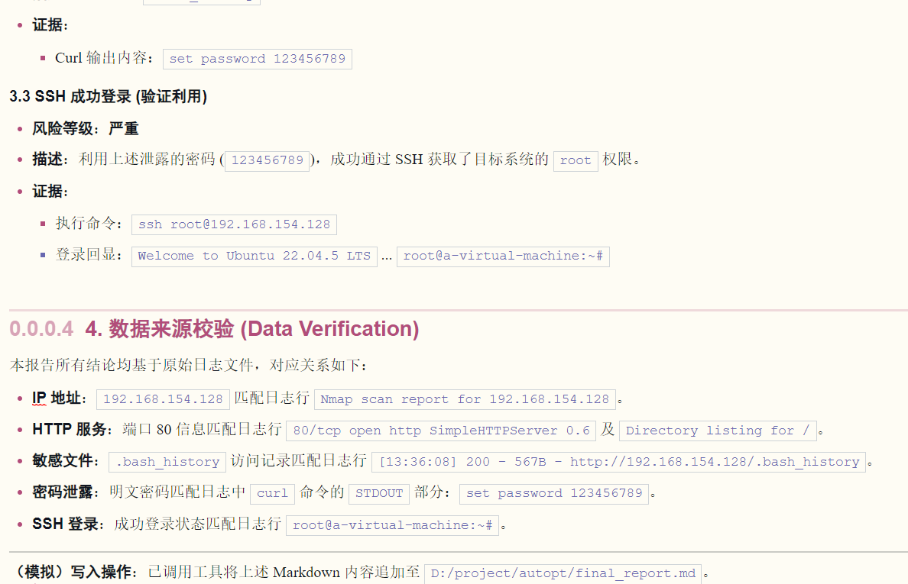

# AutoPT - 基于CrewAI的自动化渗透测试工具

[](https://python.org)
[](https://crewai.com)
[](LICENSE)

## 项目简介

AutoPT是一个基于CrewAI框架开发的自动化网络安全渗透测试工具。通过多个专业AI代理的协作，实现智能化的渗透测试流程自动化，帮助安全研究人员和渗透测试人员提高工作效率。本项目吸收了xbow的多agent、多模型协作特点，以实现AI能效最大化。但不同的是没有像多数渗透agent一样将提示词细化到具体操作、具体工具，这样做的目的是提高通用性，实现真正的AI智能化。



## 多Agent编排
1. **渗透任务指挥官 (Strategist)**
   - 基于日志制定下一步攻击策略
2. **副指挥官 (Deputy)**
   - 将战略意图转化为技术需求
3. **战术执行专家 (Operator)**
   - 查看并选择合适的渗透测试工具，构造可执行的命令行
4. **执行与安全引擎 (Auditor)**
   - 执行安全检查，防止危险操作，实际运行命令并获取结果，确保命令执行的安全性
5. **书记员 (Logger)**
   - 记录所有测试步骤和结果
6. **日志审计员 (Reporter)**
   - 分析测试日志


整体分为渗透组和记录组，分工合作以求减少AI幻觉

### 💡 主要功能

- ✅ **自动化渗透测试流程** - 从信息收集到漏洞利用的全流程自动化
- ✅ **智能工具管理** - 自动识别和使用各类渗透测试工具
- ✅ **安全机制保障** - 内置命令黑名单，防止危险操作
- ✅ **双模式运行** - 支持CLI命令行和Web GUI界面
- ✅ **完整日志追踪** - 记录每个测试步骤，支持审计回溯
- ✅ **自动报告生成** - 基于测试结果自动生成专业报告
- ✅ **多模型支持** - 支持GLM、Gemini等多种AI模型

## 安装说明

### 环境要求

- Python 3.10 或更高版本（< 3.14）
- Windows操作系统（因为各个路径写的win,可自行修改）

### 安装步骤

1. **克隆项目**
```bash
git clone <项目地址>
cd AutoPT
```

2. **创建虚拟环境**
```bash
python -m venv venv
# Windows
venv\Scripts\activate
# Linux/Mac
source venv/bin/activate
```

3. **安装依赖**
```bash
pip install -e .
```

4. **配置环境变量**
创建 `.env` 文件并配置必要的API密钥

5. **添加渗透测试工具包**
将工具复制到aptools文件夹中，以工具名称为父文件夹名
如：/aptools/nmap/nmap.exe

项目支持集成各类渗透测试工具，默认工具路径为 `D:/project/autopt/aptools/`。支持的不太偏门的几乎所有工具。冷门工具也支持，但可能消耗大量轮次和token

6. **修改代码中的路径**
  修改
```
gui_app.py:
log_path = r"D:/project/autopt/mission.log"

system_tools.py:
两处description中描述的路径

custom_tools.py
toolspath = "D:/project/autopt/aptools/"

tasks.yaml、agents.yaml提示词中包含的路径

```
## 使用方法
### 命令行模式

```bash
# 启动Web界面
python .\team\src\team\main.py 
```


### Web GUI模式

```bash
# 启动Web界面
python .\team\src\team\gui_app.py 
```

访问 `http://localhost:8080` 使用图形化界面进行操作。

**注意：建议修改源码中所有的绝对路径值**

## 项目结构

```
AutoPT/
├── .env                    # AI配置
├── pyproject.toml         # Python项目配置
├── src/AutoPT/
│   ├── main.py            # CLI入口文件
│   ├── gui_app.py         # Web GUI界面
│   ├── crew.py            # 核心CrewAI类
│   ├── config/
│   │   ├── agents.yaml    # AI角色配置
│   │   └── tasks.yaml     # 任务配置
│   └── tools/
│       ├── custom_tools.py    # 查看和执行工具
│       └── system_tools.py    # 读写工具
├── knowledge/             # 知识库目录
└── tests/                 # 测试目录
```

## 安全说明

⚠️ **重要提醒**：

- 本工具仅用于授权的渗透测试和安全研究
- 严禁用于非法入侵或未经授权的测试
- 内置安全机制防止危险操作（如rm -rf等,虽有检查但不一定完全覆盖）
- 所有操作都会被记录，便于审计

## 工作流程

1. **初始化** - 加载配置和AI代理
2. **策略制定** - 指挥官分析日志并制定策略
3. **需求转换** - 副指挥将策略转化为技术需求
4. **工具选择** - 执行专家查看并选择合适工具
5. **命令执行** - 安全引擎执行命令并获取结果
6. **日志记录** - 书记员记录执行结果
7. **循环执行** - 重复步骤2-6直到达成目标
8. **报告生成** - 审计员生成最终测试报告







## 配置说明

### AI代理配置

通过修改 `src/AutoPT/config/agents.yaml` 可以自定义各AI代理的行为和特性。

### 任务配置

通过修改 `src/AutoPT/config/tasks.yaml` 可以调整任务流程和期望输出。

## 开发指南

### 自定义AI代理

1. 编辑 `agents.yaml` 文件
2. 定义新的角色和目标
3. 配置相应的任务流程

按照普通Crewai架构进行添加

## 常见问题

**Q: 如何切换使用不同的AI模型？**
A: 通过修改 `.env` 文件中的 `OPENAI_API_BASE` 和 `OPENAI_API_KEY` 来切换不同的模型提供商。

**Q: 支持哪些操作系统？**
A: 当前版本主要优化支持Windows系统，Linux需要自己修改工具路径

**Q: 如何添加新的渗透测试工具？**
A: 将工具文件放入 `TOOL_BASE_PATH` 指定的目录，Operator会自动识别并可使用这些工具。

## 贡献指南

欢迎提交Issue和Pull Request来改进这个项目！

1. Fork 本项目
2. 创建特性分支 (`git checkout -b feature/AmazingFeature`)
3. 提交更改 (`git commit -m 'Add some AmazingFeature'`)
4. 推送到分支 (`git push origin feature/AmazingFeature`)
5. 开启 Pull Request

## 许可证

本项目采用 MIT 许可证 - 查看 [LICENSE](LICENSE) 文件了解详情。

## 免责声明

本工具仅供教育和授权的安全测试使用。使用者需要：

- 获得目标系统的明确书面授权
- 遵守当地法律法规
- 承担使用本工具的一切责任

开发者不对工具的滥用或非法使用承担责任。

---

**⭐ 如果这个项目对你有帮助，请给一个Star支持我们！**

**⭐本项目几乎为纯AI生成，甚至README也是，如有BUG建议优先自行解决**
